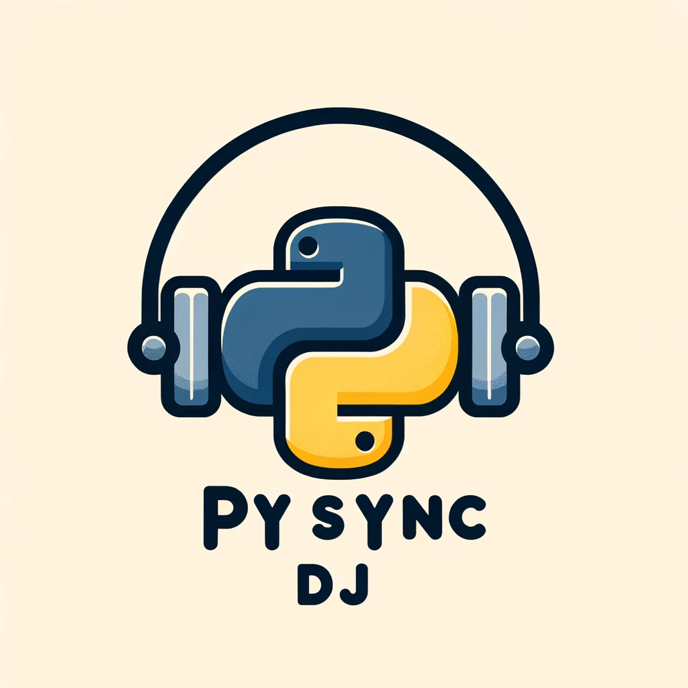

<p align="center">
  
</p>

# PySync DJ

## Overview
PySync DJ is a Python-based application designed to sync a Spotify library with a DJ library. It allows users to select Spotify playlists, downloads the tracks as MP3 files (sourced from YouTube), and integrates them with both Serato and Rekordbox DJ libraries. The project aims to streamline the often tedious process of syncing and managing music playlists so we can spend more time DJing!.

**Full Design Document [Here](docs/Design%20Specification%20Document.md)**

## Features
- **Spotify Integration**: Queries Spotify for Liked Songs and playlist information.
- **YouTube Downloading**: Downloads audio tracks from YouTube based on Spotify playlist data. (Saved in 128kbps).
- **Intelligent File Management**:
  - Avoids duplication of downloaded files, even when on multiple playlists. Reduces need for reanalysing files. 
  - Organizing tracks by Spotify track and artist names. 
  - Stores Spotify track metadata, including album cover.
- **Serato and Rekordbox Compatibility**: Seamlessly sync playlists with Serato and Rekordbox. Always have your Spotify libary ready to DJ.
- **Configurable**: Users can manually override YouTube video sources.
- **Advanced Search Algorithm**: *(Planned)* Improved search algorithms for YouTube videos with confidence levels.
- **Additional Platform Support**: *(Planned)* Future integration with SoundCloud and custom playlists.

## Installation
Ensure you have Python 3.9.13 installed. Clone the repository and install dependencies:
```bash
git clone github.com:Peter-SB/PySync-DJ.git
cd pysync_dj
pip install -r requirements.txt
```

## Configuration
Edit settings.py to configure Spotify API credentials and other settings.

```
spotify_client_id: "" # Google how to get this value
spotify_client_secret: ""
spotify_redirect_uri: "http://localhost:8888/callback" # leave as is

dj_library_directory: "E:\\" # Directory of your usb and program output
tracks_folder: "Pysync_d DJ Tracks" # Folder name for location of saved audio files
serato_subcrate_dir: "_Serato_\\Subcrates" # Location of your serato subcrates
rekordbox_playlist_folder: "Rekordbox Playlist Import Files" # Folder name for location of saved rekordbox m3u files

download_liked_songs: true # Should download users liked songs? (true/false)
liked_songs_track_limit: null  # How many of your liked songs to download (integer)
liked_songs_date_limit: 27-08-23 # Date to download back to (DD-MM-YYYY)

playlists_to_download:
  PLaylist1: "2rBDG7m5QcjM3OjHyorkMZ" # Can use either just playlist id
  Playlist2: "https://open.spotify.com/playlist/2rBDG7m5QcjM3OjHyorkMZ" # or full url
```
leave `liked_songs_track_limit` and `rekordbox_playlist_folder` as `null` to not use limit.

## Usage
Run the program from the command line:

```bash
python pysync_dj.py
```

If the program pauses without doing anything for more than a few mins, you can always stop it and try again.

Logs in the `logs\` directory 


### Custom Video URLs
Put the video url inplace of the current file name in `id_to_video_map.json`
```
    "5cRDn5aGMLvWsldoRmOOz0": "E:\\pysync_dj_tracks\\Sub Focus - Solar System.mp4",
```

to

```
    "5cRDn5aGMLvWsldoRmOOz0": "https://www.youtube.com/watch?v=TUebWv_QXCM",
```

## Contributing
Contributions to PySync DJ are welcome. 

## Acknowledgements
Special thanks to the developers of the used libraries, especially Pytube but also including Spotipy and others listed in requirements.txt.

Thanks also to kerrickstaley for their parse_serato_crates.py code.
